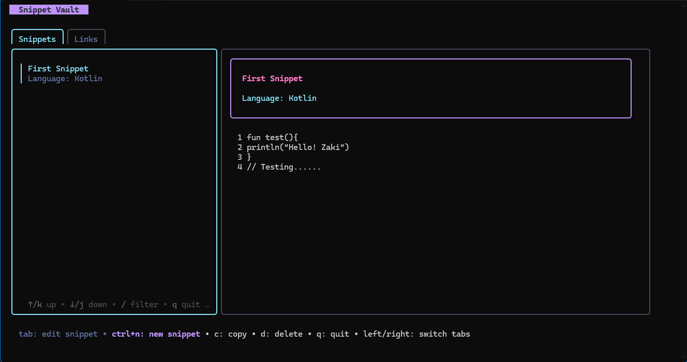

<h1 align="center">Snippet Vault</h1>

<p align="center">
  
</p>

<p align="center">
  <strong>A lightning-fast, keyboard-driven terminal UI for managing code snippets.</strong>
</p>

<p align="center">
  <a href="https://github.com/iammohdzaki/snippet-vault-go/releases/latest"></a>
  <a href="https://github.com/iammohdzaki/snippet-vault-go/actions"></a>
  
  
</p>

---

## 🚀 Overview

**Snippet Vault** is a blazingly fast snippet manager written in Go. It runs entirely in your terminal, using a beautiful `bubbletea` powered UI. 

Behind the scenes, it operates as a fully standalone application. It spins up a background HTTP server and persists your snippets seamlessly into a local, pure-Go SQLite database (`~/.snippet-vault/vault.db`).

## ✨ Features

- **Keyboard-Driven:** Never touch your mouse. Navigate, edit, save, and delete entirely via keyboard shortcuts.
- **Always Editable:** The editor pane is a native text area. Just hit `tab` to start typing.
- **Copy to Clipboard:** One keystroke (`c` or `ctrl+b`) grabs your code and drops it in your clipboard.
- **Fuzzy Search:** Press `/` to instantly filter through hundreds of snippets.
- **Standalone:** No dependencies, no setup, no external C-compilers. It uses a pure-Go SQLite implementation.

## 📦 Installation

### Option 1: Download from Releases
Head over to the [Releases Page](https://github.com/iammohdzaki/snippet-vault-go/releases) and download the compiled binary for your operating system (Windows, macOS, Linux).

### Option 2: Build from Source
Ensure you have Go 1.23+ installed.

#### Unix (Linux / macOS)
```bash
git clone https://github.com/iammohdzaki/snippet-vault-go.git
cd snippet-vault-go
./manage.sh install
```

#### Windows (PowerShell)
```powershell
git clone https://github.com/iammohdzaki/snippet-vault-go.git
cd snippet-vault-go
.\manage.ps1 -Command install
```

## 🎮 Usage

Simply run:
```bash
vault
```
*(Ensure `~/.snippet-vault/bin` or `~/.local/bin` is in your system `PATH`!)*

### Keybindings

| Key | Context | Action |
| --- | ------- | ------ |
| `↑` / `k` | List | Move up |
| `↓` / `j` | List | Move down |
| `/` | List | Search snippets |
| `c` | List | Copy selected snippet to clipboard |
| `d` | List | Delete selected snippet (prompts for `y/n` confirmation) |
| `ctrl+n` | List | Create a new blank snippet |
| `tab` | Global | Switch focus between the Snippets List and Editor |
| `shift+tab` | Editor | Cycle backwards between Title, Language, and Code fields |
| `ctrl+s` | Editor | Save or Update the snippet |
| `ctrl+b` | Editor | Copy the code currently in the editor to your clipboard |
| `esc` | Editor | Return focus to the Snippets List |

## 🛠️ Architecture

Snippet Vault is composed of two main pieces, completely decoupled but shipped in a single binary:
1. **The Server (`internal/server`)**: An HTTP REST API serving JSON endpoints, powered by `modernc.org/sqlite` for database persistence.
2. **The TUI (`internal/tui`)**: A Bubble Tea Model architecture that makes asynchronous HTTP calls to the server running on `localhost:8080`.

To run *just* the headless server (e.g., if you want to connect a custom web frontend to your snippet database):
```bash
vault-server
```

## 🤝 Contributing
Contributions, issues, and feature requests are welcome!

1. Fork the Project
2. Create your Feature Branch (`git checkout -b feature/AmazingFeature`)
3. Commit your Changes (`git commit -m 'Add some AmazingFeature'`)
4. Push to the Branch (`git push origin feature/AmazingFeature`)
5. Open a Pull Request

## 📝 License
Distributed under the MIT License.
